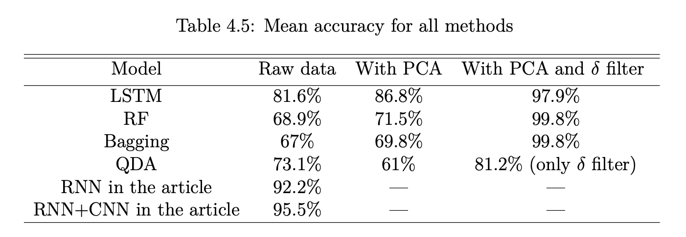

# rnn_brain_reading

Recurrent Neural Network and other methods for interpreting EEG signals.

Brain–computer interface (BCI) combines methods, approaches, and ideas from neurophysiology, computer science and engineering to determine real-time two- way connections between living brains and external devices. The classification of electroencephalogram (EEG) signals is of significant importance in BCI systems. Machine learning methods, in particular artificial neural networks, are increasingly popular among classification models in BCI systems.

This work compares a few different machine learning methods in the EEG signal classification problem.

Partially based on: Xiang Zhang et al. “Converting Your Thoughts to Texts: Enabling Brain Typing via Deep Feature Learning of EEG Signals”. In: (2017). doi: 10.48550/arXiv.1709. 08820
